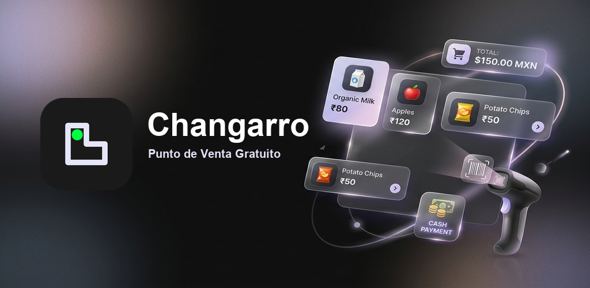
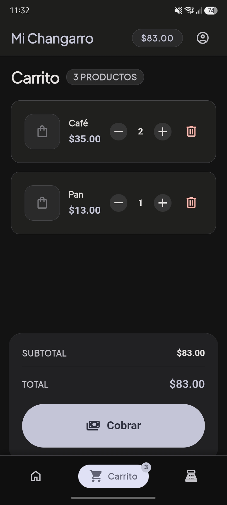
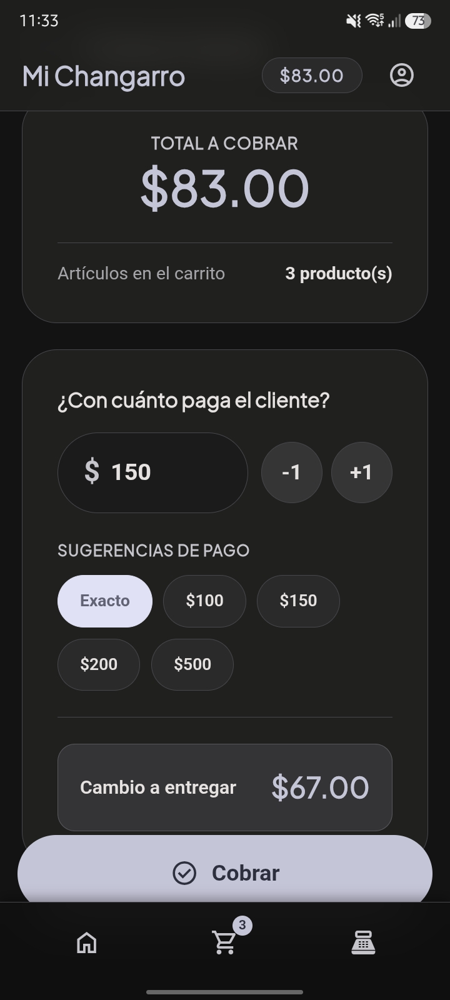
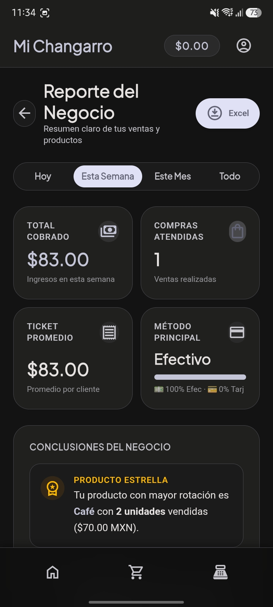
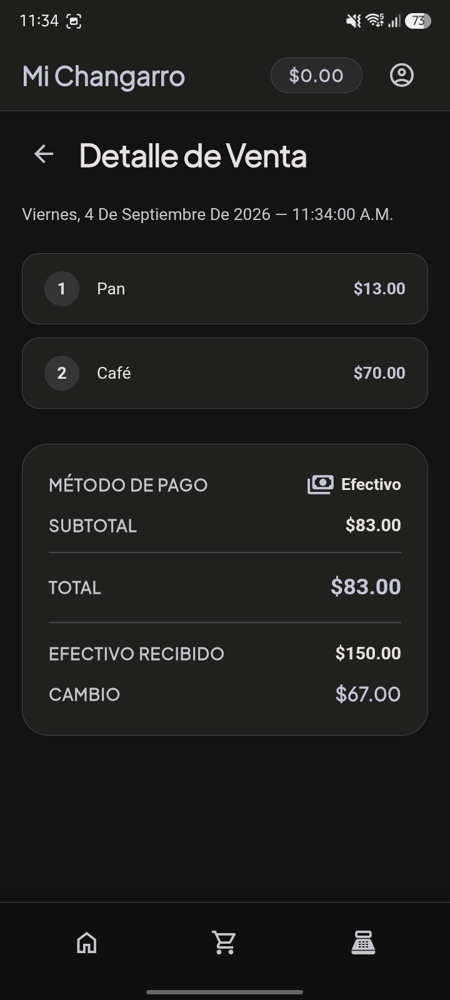

<div align="center">



# Changarro

**Tu punto de venta, sin internet y sin mensualidades.**

Una herramienta gratuita hecha para el verdadero motor del barrio: la tiendita de la esquina, la papelería, la fonda, el puesto del mercado y cualquier persona con un negocio local que quiera llevar las cuentas de lo que vende sin enredarse ni pagar rentas.

[](https://github.com/bendito-codigo/changarro-app/releases)
[%20%7C%20Web-4ade80?style=flat-square&labelColor=20201f)](https://github.com/bendito-codigo/changarro-app/releases)
[](#)
[](./LICENSE)
[](https://benditocodigo.com)

</div>

---

## 🎯 ¿Para quién es Changarro?

Para ti, si:

- 🏪 Tienes una tienda de barrio, abarrotes, papelería, fonda o negocio similar
- 📓 Llevas el control en libreta o directamente en la memoria
- 📵 No tienes internet estable o simplemente no quieres depender de él
- 💸 No quieres pagar una suscripción mensual por un software caro y complicado
- 🔒 Quieres que los datos de tu negocio se queden **en tu teléfono o computadora**, no en servidores de terceros

---

## 🏪 Nuestro Propósito

Changarro no es otro sistema corporativo o complicado disfrazado de "solución premium". Es nuestra forma de apoyar al comerciante de verdad. 

En México y América Latina, millones de tienditas y negocios locales siguen usando libreta porque la tecnología a veces se siente como un dolor de cabeza. Los sistemas tradicionales suelen poner muchas trabas:

* 💸 **Rentas mensuales caras:** Te cobran suscripciones que se comen las ganancias de tu negocio.
* 📵 **Sin internet no jalan:** Muchas apps en la nube se traban cuando fallan los datos o la señal.
* 😵‍💫 **Muy difíciles de usar:** Tienen pantallas complicadas pensadas para grandes empresas, no para quien necesita cobrar rápido mientras atiende la fila.
* 🔒 **Se quedan con tus datos:** Guardan tus productos y ventas en servidores ajenos sin darte control real.

En Bendito Código creamos Changarro para quitar todas estas trabas de golpe:
* **Independencia total:** Funciona 100% sin internet. Todo se guarda directo en tu celular o computadora.
* **Gratis de verdad:** Sin versiones "pro", sin funciones bloqueadas y jamás con anuncios.
* **Facilito de usar:** Diseñado para que cualquier persona pueda registrar su primera venta en menos de tres minutos.
* **Tus números son tuyos:** No andamos de metiches con lo que vendes. Tu información jamás sale de tu dispositivo.

> **Changarro**: un negocio pequeño, familiar, de barrio. Refleja exactamente a quién va dirigida: al comerciante real, no a la corporación.

---

## ✨ Lo que puedes hacer con Changarro

| Función | Descripción |
|---|---|
| 🛒 **Registrar ventas en segundos** | Toca un producto y se agrega al carrito. Así de rápido y sencillo |
| 💳 **Formas de pago flexibles** | Cobra en efectivo, tarjeta o transferencia sin complicaciones |
| ⚡ **Venta rápida al instante** | Cobra un servicio o producto rápido sin necesidad de registrarlo en el catálogo |
| 💵 **Cálculo de cambio automático** | Pon cuánto dinero te entregan y la app calcula el cambio al momento |
| 📷 **Escáner de código de barras** | Usa la cámara de tu celular para buscar y asignar productos rápido |
| 📦 **Catálogo de productos** | Organiza tus artículos con precio, fotos, unidades, categorías y código |
| 💰 **Historial de ventas** | Revisa lo que has vendido en el día, turno o mes con cuentas claritas |
| 🕐 **Cortes de caja y turnos** | Controla las ventas por turno para que las cuentas cuadren al cerrar el día |
| 💻 **Vista cómoda en pantalla grande** | Acceso rápido al carrito flotante si cobras desde una computadora |
| 💾 **Respaldo con un solo clic** | Guarda una copia de tus datos para llevarla a otro celular cuando quieras |
| 📵 **100% Offline y seguro** | No requiere internet ni servidores externos. Tus datos se quedan contigo |

---

## 📸 Vista Previa (Capturas de pantalla)

<div align="center">

| Inicio (Catálogo) | Pantalla de Cobro |
|:---:|:---:|
|  |  |

| Reporte del Negocio | Detalle de Venta |
|:---:|:---:|
|  |  |

</div>

---

## 📲 Disponibilidad y Descarga

Puedes descargar los paquetes e instaladores listos para usar en la sección de [**Releases de GitHub**](https://github.com/bendito-codigo/changarro-app/releases):

* 🍏 **macOS (Escritorio):** Instalador `.dmg` listo para arrancar en tu Mac.
* 🤖 **Android (Móvil / Tablet):** Paquete `.apk` listo para instalar en tu teléfono o tablet. *(Próximamente disponible en Google Play Store)*.
* 🌐 **Web (SPA / PWA):** Funciona offline directo en el navegador de cualquier dispositivo.
* 💻 **Windows / iOS:** *En desarrollo activo.* Estarán disponibles muy pronto.

---

## ⚙️ Transparencia Técnica: Lo que hay bajo el capó

Aunque Changarro es súper sencilla por fuera, por dentro tiene ingeniería sólida para asegurar que jamás te falle:

* **Base de datos en tu dispositivo (IndexedDB + Dexie.js):** Todo lo de tu negocio (catálogo, ventas, turnos) se guarda en la memoria local de tu equipo. Es ultra veloz y nadie desde fuera puede ver tus números.
* **Historial seguro (snapshots de precio):** Si hoy le subes el precio a un producto, las ventas pasadas se quedan con el precio que tenían en ese momento para no descuadrar tus reportes.
* **Soporte Multiplataforma (Capacitor + Electron):** Usamos tecnologías modernas para mantener la app ligera y fluida tanto en teléfonos como en computadoras.

### 🚀 Para desarrolladores (Compilación desde código fuente)

Si quieres compilar la app tú mismo o revisar cómo está construida:

**Requisitos:**
- [Node.js](https://nodejs.org) v22 o superior
- [Git](https://git-scm.com)
- [Android Studio](https://developer.android.com/studio) (solo para compilar el APK de Android)

**Pasos rápidos:**

```bash
# 1. Clona el repositorio
git clone https://github.com/bendito-codigo/changarro-app.git
cd changarro-app

# 2. Instala las dependencias
npm install
cd electron && npm install && cd ..

# 3. Arranca el entorno de desarrollo
npm run dev
```

Abre `http://localhost:5173` en tu navegador.

**Compilar paquetes ejecutables:**
```bash
# Crear instalador macOS (.dmg)
npm run build:dmg

# Crear paquete APK de Android
npm run build:apk:release
```

Para más detalles técnicos, consulta la [guía de entorno de desarrollo](./documentacion/manuales-tecnicos/02-entorno-desarrollo.md).

---

## 📖 Documentación

| Guía | Descripción |
|---|---|
| [📘 Introducción](./documentacion/manuales-usuario/01-introduccion.md) | Qué es Changarro y cómo empezar |
| [🚦 Primeros pasos](./documentacion/manuales-usuario/02-primeros-pasos.md) | Tu primera venta paso a paso |
| [🗺️ Navegación](./documentacion/manuales-usuario/03-navegacion.md) | Guía completa de las pantallas |
| [🏗️ Arquitectura](./documentacion/manuales-tecnicos/01-arquitectura.md) | Cómo está construida la app (para desarrolladores) |
| [💻 Entorno de desarrollo](./documentacion/manuales-tecnicos/02-entorno-desarrollo.md) | Cómo configurar tu entorno de código |
| [🗂️ Estructura del código](./documentacion/manuales-tecnicos/03-estructura-codigo.md) | Organización interna del proyecto |

---

## 🔒 Privacidad: Tus datos son tuyos

Changarro se rige bajo una regla indiscutible:

> **Tus datos son tuyos y de nadie más.**

- ❌ Sin servidores centrales guardando tus ventas
- ❌ Sin rastreo, telemetría ni anuncios
- ❌ Sin registro obligatorio de correo ni contraseñas
- ✅ Todo se guarda directo en tu dispositivo
- ✅ Puedes exportar e importar un respaldo cuando quieras

---

## 🤝 Comunidad y Código Abierto

Changarro es un proyecto libre diseñado para durar. Se publica bajo la licencia **PolyForm Noncommercial License 1.0.0**, lo que significa que cualquiera puede usar la app, revisar cómo está hecha y adaptarla de forma gratuita para su negocio o comunidad (sin revenderla ni lucrar con el trabajo).

El proyecto es desarrollado y mantenido con cariño por [Bendito Código](https://benditocodigo.com). **No aceptamos Pull Requests directos** para mantener la consistencia del diseño y seguridad de la app, pero nos encanta escuchar a la comunidad:

- 🐛 **¿Encontraste un error?** → Abre un [Issue](https://github.com/bendito-codigo/changarro-app/issues) describiendo lo que sucedió.
- 💡 **¿Tienes una idea?** → Abre un Issue con la etiqueta `sugerencia`.
- 💬 **¿Quieres charlar o preguntar algo?** → Pásate por las [Discussions en GitHub](https://github.com/bendito-codigo/changarro-app/discussions).

---

## 🛠️ Stack Tecnológico

<div align="center">

[](https://vuejs.org)
[](https://vite.dev)
[](https://tailwindcss.com)
[](https://www.typescriptlang.org)
[](https://capacitorjs.com)
[](https://www.electronjs.org)
[](https://dexie.org)

</div>

---

## 📄 Licencia

Changarro se distribuye bajo la licencia **PolyForm Noncommercial License 1.0.0**.

Esto significa que:
- ✅ Puedes usarla libremente en tu negocio o de forma personal
- ✅ Puedes modificarla y adaptarla a tus necesidades
- ✅ Puedes compartirla con más personas
- ❌ No puedes comercializarla ni venderla como producto propio

Revisa el archivo [LICENSE](./LICENSE) para ver los términos completos.  
© 2026 Mauro Nava Luevanos — [benditocodigo.com](https://benditocodigo.com)

---

<div align="center">

Desarrollada con propósito 🫀 por [**Bendito Código**](https://benditocodigo.com)

*Un changarro pa' los changarros* 🏪

</div>

